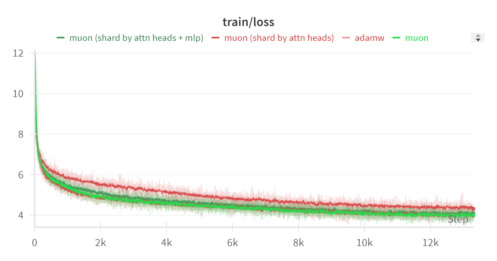
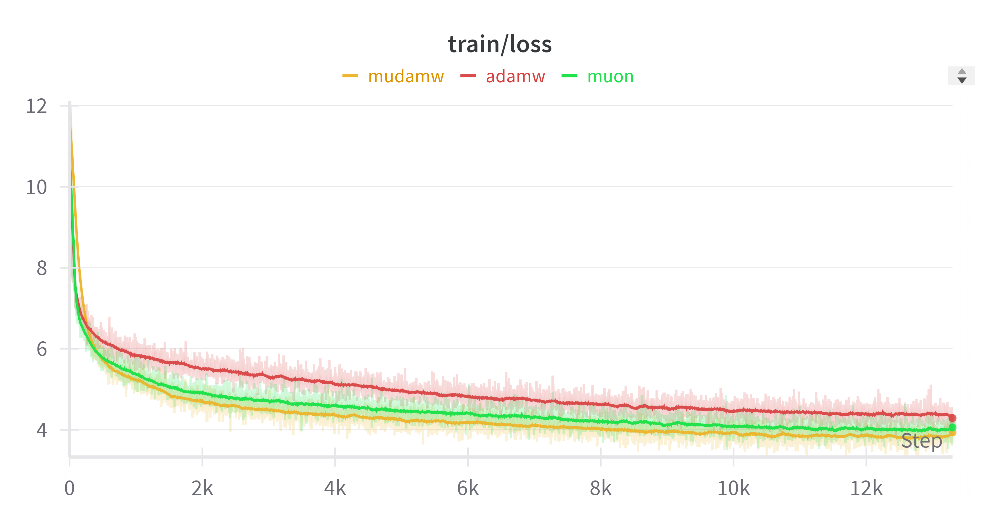

# Super Muon
People complain about Muon not being able to do tensor parallel efficiently. But here is the thing, you can simply just shard it and do Newton Schulz on the local copies.
This repo is adopted from the [Kimi toy example](https://github.com/MoonshotAI/Moonlight/blob/master/examples/toy_train.py)

# Run Command
```bash
torchrun \
    --rdzv_id=$SLURM_JOB_ID \
    --rdzv-backend=c10d \
    --nnodes=1 \
    --nproc-per-node=1 \
    --rdzv_endpoint=$MASTER_ADDR:$MASTER_PORT \
    moonlight_toy_train.py --model qwen --optimizer sharded_muon --dataset openwebtext-100k --hidden_size 896 --lr 1e-3 --run_name sharded_muon
```

# Preliminary Result

## Sharded Muon Results


## MudamW, because why not

